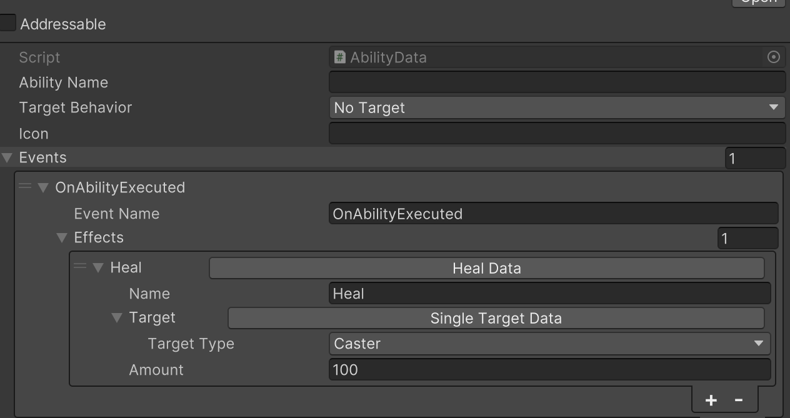
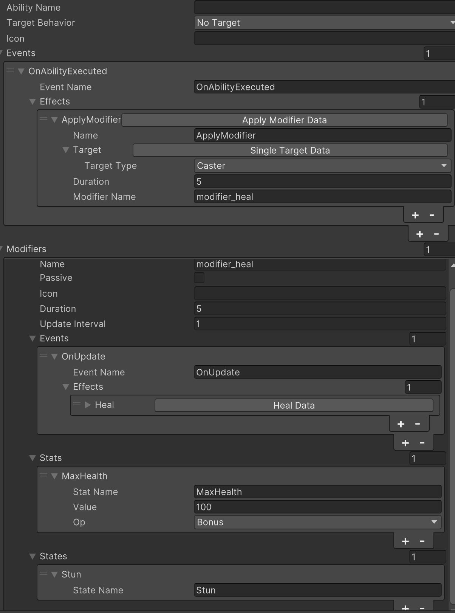
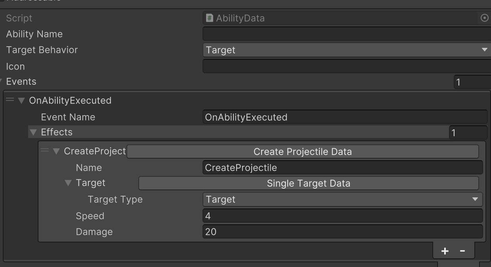

# Unity Ability System

Unity Ability System (UAS for shot) is a Unity framework for creating abilities with minimal effort. 

## How it works
 An ability usually consists of three components: Event, Effect and Modifier.

### Event 
Abilities can have various in-game events which can trigger associated effects. There are two types of event: ability event and modifier event. Modifier events can be extended while ability events are built-in. To provide your own modifier event, it should inherit from ```IModifierEvent``` interface. 
```C#
public struct MyCustomEvent : IModifierEvent
{
    public float customData;   
    public void FillActionParams(ref EffectParams effectParams)
    {
        
    }
}
```
```FillActionParams``` is the place where to pass intrested event data to effect.

### Effect
An effect is what truly impacts the game within the context of an ability.  UAS has some built-in effects like ```ApplyModifier``` which applies modifier to an unit. Custom effect is required to inherit from ```Effect``` and implements ```Execute``` method.
```C#
public abstract class Effect
{
    public abstract void Execute(ref EffectParams effectParams);
}
``` 

In most cases, effect need targets to apply on.  UAS provides a ```SingleTargetData``` class to find single target. If it is not what you want, you can implement your own version by inheriting from ```TargetData```.
```C#
public abstract class TargetData
{
    public abstract void FindTargets(List<IUnit> results, ref EffectParams effectParams);
}
```

### Modifier
Modifiers can be applied to units, altering their behavior by modifying various aspects such as stats, states, and event listeners. If you want continuous behavior like taking damage every second, ```updateInterval``` should be greater than zero, then an ```OnUpdate``` event will be triggered every ```updateInterval``` second.
#### Stat
Inheriting from ```Stat``` to make a new stat type
```C#
public class Health : Stat<Health>
{
    public Health(float value) : base(value)
    {
    }

    public override string GetName()
    {
        return nameof(Health);
    }
}
```
#### State
State is sort of like logic switch in game. Modifier can turn on various switches to affect unit's behaviors. For exampe, when stun state is on, then the unit can not move. State is defined as flag enumeration.
```C#
[Flags]
public enum UnitState
{
    None = 0,
    Stun = 1 << 0,
}
```

## Example
* Ability1 heals caster when casted. 


* Ability2 applies a modifier to caster that lasts 5 seconds. This modifier increases max health, stuns the unit and heals every second.


* Ability3 shoot a project to target.


## Future
I'm not sure if I have time to accomplish the following tasks, but i'll list them here as a reminder.
* Multiplayer
* Animation and vfx
* Turn-based games support
* Editor improvement
* Full-fledged RPG framework?
